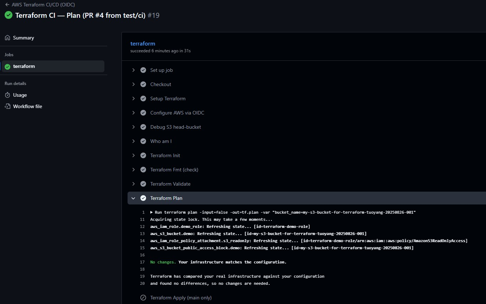
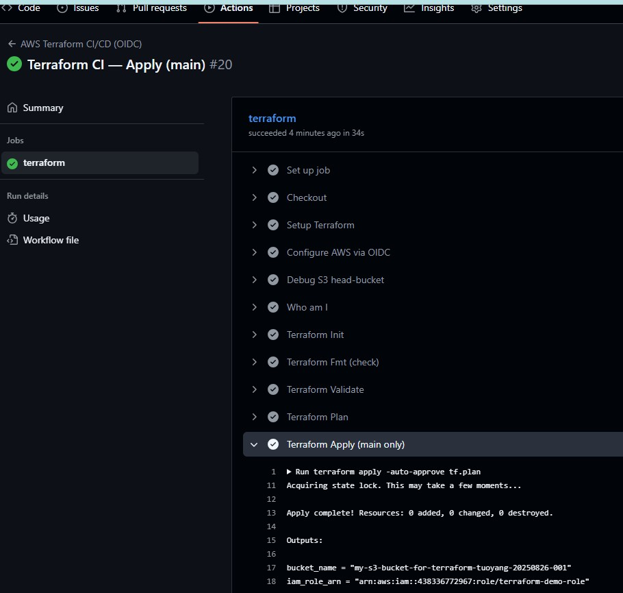
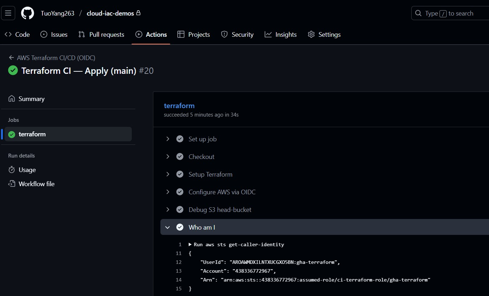
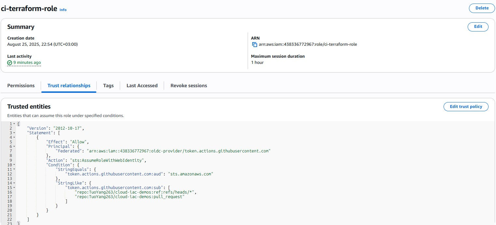
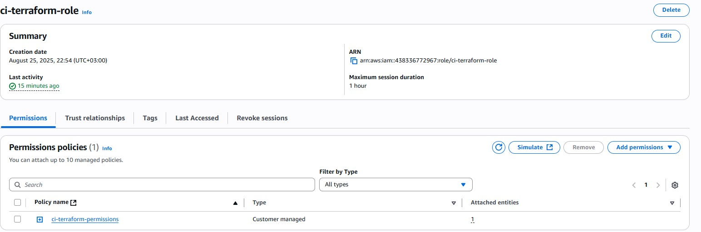
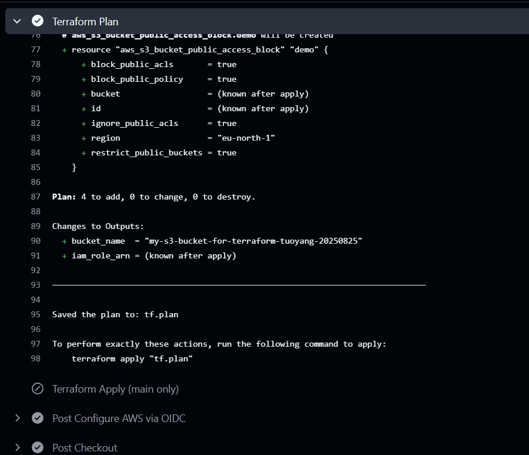
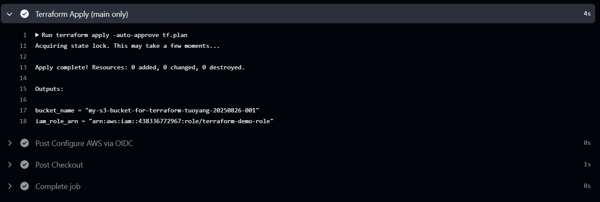

# Cloud IAC Demos – Terraform on AWS (GitHub OIDC)
This repo shows how to use **Terraform** with **GitHub Actions + OIDC** (no long-lived keys) to create:
* one **S3 demo bucket**, and
* one small **IAM role** for the demo.

CI runs `plan` on pull requests and runs `apply` only after merging to **main**.
**Region**: the demo uses **eu-north-1 (Stockholm)**.
**Cost**: practically free (S3 + one IAM role). Destroy when you’re done.

---

## What’s in the repo

```text
.github/workflows/terraform.yml      # GitHub Actions workflow (OIDC)
aws-demo/
  backend.tf                         # Remote state (S3 + DynamoDB lock)
  main.tf                            # Demo resources (S3 + IAM role)
  variables.tf                       # Input variables (bucket_name)
  outputs.tf                         # Terraform outputs
policies/
  trust-policy.json                  # OIDC trust policy for ci-terraform-role
  permissions-policy.json            # Minimal permissions for that role
docs/
  img/                               # Screenshots for Terraform, AWS, and GitHub Actions
    gha-apply.jpg
    gha-plan.jpg
    ...
```

---

## One-time AWS setup
**1. Remote state (do this once)**
* Create an S3 bucket, e.g. `tf-state-438336772967-eu-north-1`.
* Create a DynamoDB table tf-lock-eu-north-1 (partition key LockID).
* These names are already referenced in aws-demo/backend.tf.

**2. Create the OIDC role for GitHub Actions**
* Role name: `ci-terraform-role`
* Trust policy: `policies/trust-policy.json`
  (allows this GitHub repo and PRs to assume the role via OIDC)
* Permissions: attach `policies/permissions-policy.json`
  (just enough access for remote state + the demo bucket + the demo IAM role)
* No access keys are needed. GitHub Actions will assume this role with OIDC.

The permissions are already tested. If you want to lock it down even more later, you can replace the wildcard bucket pattern with your final bucket name.

---

## Repo variable (optional)
* `BUCKET_NAME` – the name for the demo S3 bucket (must be globally unique).
If you don’t set it in repo **Variables**, Terraform will simply ask you during `plan/apply`.

Example: `my-s3-bucket-for-terraform-tuoyang-20250826-001`

---

## Run locally

```bash
cd aws-demo

# (Optional) use a local profile
export AWS_PROFILE=demo
export AWS_REGION=eu-north-1

# First time or when backend changed
terraform init -reconfigure

# Plan (you can also omit -var and let Terraform prompt)
terraform plan -var "bucket_name=my-s3-bucket-for-terraform-tuoyang-20250826-001"

# Apply
terraform apply -auto-approve -var "bucket_name=my-s3-bucket-for-terraform-tuoyang-20250826-001"
```

## CI behavior (GitHub Actions)
* The workflow is in .github/workflows/terraform.yml.
* Steps (simplified):
    1. Checkout
    2. Install Terraform
    3. **Assume** ci-terraform-role **via OIDC** (no secrets)
    4. `terraform fmt -check`, `terraform validate`, `terraform plan`
    5. On **PR** → only `plan`
       On **main** → run `apply`
* There is a small **“Who am I”** step (`aws sts get-caller-identity`) so you can see it’s using `assumed-role/ci-terraform-role`.

## Inputs & outputs
* **Input**
    * `bucket_name` (string): your demo bucket name
* **Outputs**
    * `bucket_name`
    * `iam_role_arn` (for the demo IAM role)
    
---

## Quick troubleshooting

Most issues are simple. Check these first:
1. **OIDC assume failed**
Make sure you used the provided `trust-policy.json` and the repo/branch/PR conditions match your setup.
2. **Bucket not found or wrong region**
The name in `BUCKET_NAME` (or the prompt) must match the region `eu-north-1`.
3. **S3 action name errors**
Use the exact actions in `permissions-policy.json` (e.g. `s3:GetBucketPublicAccessBlock`, `s3:PutLifecycleConfiguration`).
4. **Inline role policy listing denied**
The policy already includes `iam:ListRolePolicies`. If you changed it, add that back.
5. **BucketAlreadyOwnedByYou**
Pick a new unique `bucket_name` (add a date or counter).

---

## Permission notes (short version)
The policy grants only what’s needed:
* Read/write **remote state** in your specific state bucket/prefix and lock table.
* Configure and use **only** demo buckets matching
`arn:aws:s3:::my-s3-bucket-for-terraform-tuoyang-*` (and their objects).
* Create/inspect/attach managed policy for the **demo IAM role**
`arn:aws:iam::<your-account-id>:role/terraform-demo-role`.
(It does not grant `PassRole`.)

If you want to make it even tighter later, replace the bucket wildcard with your final bucket ARN.

---

## Clean up

```bash
terraform destroy -auto-approve -var "bucket_name=<your-bucket>"
```

If you’re done with the demo for good, empty and delete the remote state bucket and the DynamoDB lock table (or keep them for future demos).

---

## Screenshots
* GitHub Actions:
    * PR run with a green `plan`
    
    * `main` run with a green `apply`
    
    * The “Who am I” output showing `assumed-role/ci-terraform-role`
    
* AWS Console:
    * IAM role `ci-terraform-role` trust & permission policies
    
    
    * The demo S3 bucket settings (Versioning, Public access block, Lifecycle, Encryption)
    

* Terraform logs: key parts of `plan` and `apply`
    
    