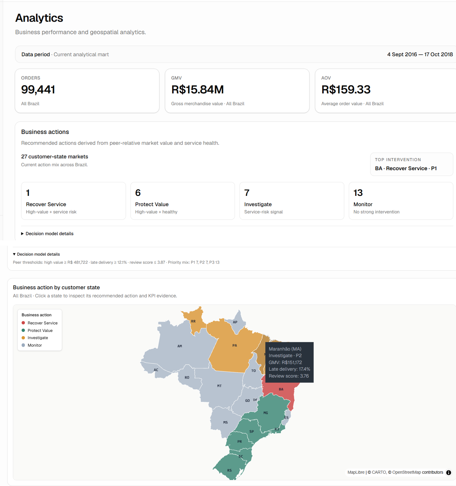
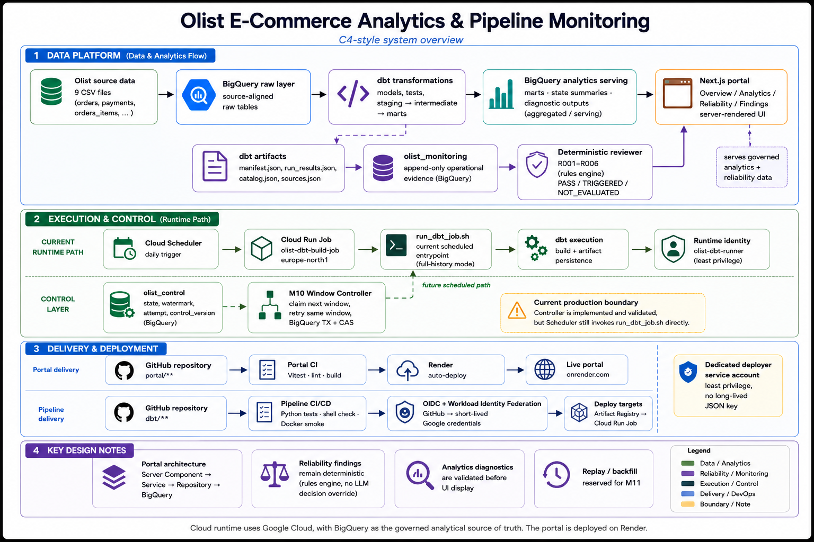
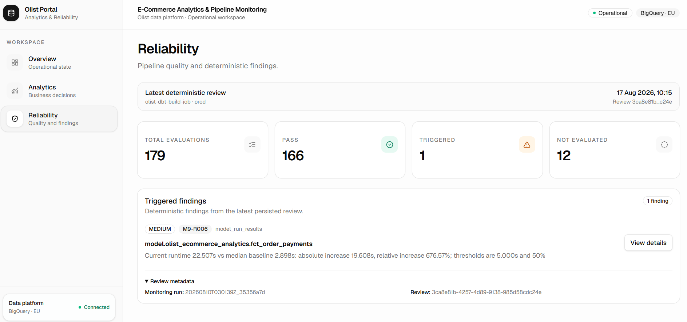
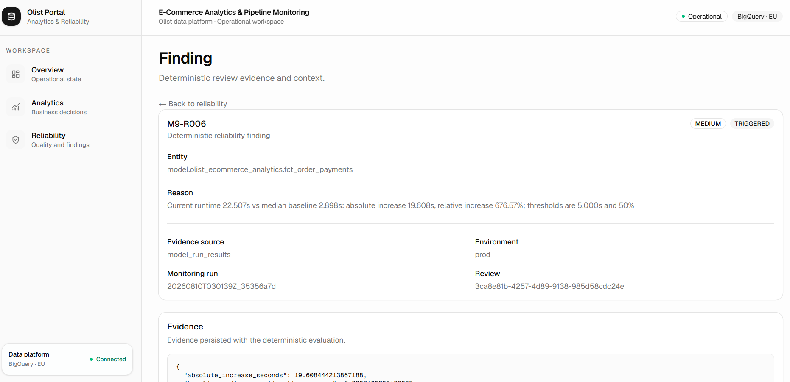

# Olist E-Commerce Analytics & Pipeline Monitoring Portal

A production-oriented e-commerce analytics and data reliability product built on the Olist Brazilian E-Commerce dataset.

**Live portal:** https://olist-analytics-portal.onrender.com
**Health check:** https://olist-analytics-portal.onrender.com/health

> The public demo runs on Render's free tier, so the first request after inactivity can take longer while the service wakes up.

## Project highlights

- **Analytics + reliability in one product:** business KPIs, geospatial decisions, pipeline state, quality findings, and evidence drill-down share one governed BigQuery foundation.
- **Deterministic reliability engine:** R001-R006 evaluate persisted evidence. Optional AI explanation is downstream and cannot change rule results or severity.
- **Explicit window semantics:** forward-only `[window_start, window_end)` processing, failure without watermark advance, same-window retry, audit history, and BigQuery transaction + CAS protection.
- **Decision-oriented analytics:** Brazil state-level actions, priorities, and persisted statistical diagnostics validated before UI display.
- **Separated delivery boundaries:** Portal and pipeline CI/CD are independent. GitHub-to-GCP deployment uses OIDC + Workload Identity Federation and a least-privilege deployer identity.
- **Real validation:** 118/118 dbt checks, 116 backend Python unit tests, and 21/21 Portal Vitest tests.

## Product preview



The analytics workspace links commercial value and service-health evidence to state-level actions such as **Recover Service**, **Protect Value**, **Investigate**, and **Monitor**.

## System architecture



Editable source: [`assets/architecture/olist-system-architecture.drawio`](assets/architecture/olist-system-architecture.drawio)

The current scheduled production path still invokes `run_dbt_job.sh` in full-history compatibility mode. The M10 Window Controller is implemented and validated, but it is not yet the Cloud Scheduler entry point.

## Product capabilities

### Analytics

The `/analytics` workspace provides:

- Brazil state-level order, GMV, AOV, delivery, and review evidence
- geospatial state selection and linked KPI context
- deterministic Business Decision Model v1
- P1 / P2 / P3 priorities
- Statistical Review Diagnostic v2
- persisted diagnostic validation before rendering

The current decision model classifies the 27 Brazilian states into:

```text
Recover Service
Protect Value
Investigate
Monitor
```

### Reliability



The `/reliability` workspace reads persisted M9 review results and preserves three outcomes:

```text
PASS
TRIGGERED
NOT_EVALUATED
```

`NOT_EVALUATED` remains visible when evidence is missing or unusable.

The deterministic rule set is:

| Rule | Check |
|---|---|
| R001 | Pipeline Run Unsuccessful |
| R002 | Model Execution Non-Success |
| R003 | Test Result Non-Passing |
| R004 | Model Missing from Current Run |
| R005 | Row-Count Anomaly |
| R006 | Runtime Regression |

Historical comparisons use comparable successful runs with the same `job_name` and `environment`, with a median baseline over up to five prior runs where required.

### Finding evidence



Finding detail pages expose persisted evidence instead of only showing a status badge. The server validates finding identity and evidence consistency before rendering.

### Operational state

The `/overview` workspace exposes:

- pipeline state
- environment
- active attempt
- control version
- processing window / watermark
- controller freshness
- latest error evidence

## Data platform

The analytical path is:

```text
Olist source data
        ↓
BigQuery raw
        ↓
dbt staging
        ↓
dbt intermediate
        ↓
dbt marts
        ↓
analytics serving
        ↓
Next.js Portal
```

| Layer | Purpose |
|---|---|
| Raw | Source-aligned BigQuery tables |
| Staging | Cleaning, casting, naming, stable source interfaces |
| Intermediate | Reusable order-level logic and transaction-window anchoring |
| Marts | Analytics-ready facts and dimensions |
| Monitoring | Append-only pipeline, model, test, metadata, and lineage evidence |
| Control | Current pipeline state plus append-only window events |
| Analytics serving | State summaries and persisted diagnostic outputs |

The four transactional fact models use incremental `MERGE` semantics with stable unique keys, allowing a failed window to be processed again without duplicating rows for the same keys.

## Monitoring and deterministic review

After dbt execution, the monitoring layer persists evidence from:

```text
manifest.json
run_results.json
catalog.json
```

into:

```text
pipeline_runs
model_run_results
test_run_results
model_metadata_snapshots
model_column_snapshots
model_lineage_edges
```

M10 adds `control_attempt_id` to `pipeline_runs`, allowing a governed attempt to resolve its exact monitoring run.

```text
dbt artifacts
    ↓
olist_monitoring
    ↓
deterministic reviewer
    ↓
persisted evaluations / findings
    ↓
Portal reliability views
```

Optional Vertex AI explanation is downstream of deterministic evaluation and cannot create or modify findings.

## Window and watermark control

Core M10 invariants:

```text
1. The normal watermark only moves forward.
2. A failed workload does not advance the watermark.
3. Retry reuses the same failed window.
4. Every retry receives a new attempt_id.
5. State + audit-event writes commit in one BigQuery transaction.
6. Stale concurrent writers are rejected by control_version CAS.
7. One control attempt resolves one exact monitoring run.
```

The control state model includes:

```text
IDLE
RUNNING
FAILED
WAITING_RETRY
QUARANTINED
```

Real validation included two failed attempts followed by a successful third attempt for the same window. The watermark remained unchanged until the successful attempt.

Detailed control documentation: [`docs/m10_window_control.md`](docs/m10_window_control.md)

## Portal architecture

The Portal uses a server-side boundary rather than exposing BigQuery directly to browser code:

```text
Next.js Server Component
        ↓
Service
        ↓
Repository
        ↓
BigQuery
```

Main routes:

```text
/overview
/analytics
/reliability
/findings/[findingId]
/health
```

The service layer verifies persisted analytics diagnostics and reliability evidence before rendering.

Detailed Portal documentation: [`docs/m10_portal_analytics.md`](docs/m10_portal_analytics.md)

## Cloud runtime and CI/CD

Current scheduled runtime:

```text
Cloud Scheduler
      ↓
Cloud Run Job
      ↓
Docker image
      ↓
run_dbt_job.sh
      ↓
dbt build + monitoring persistence
      ↓
BigQuery
```

Current boundaries:

- Cloud Run Job: `europe-north1`
- Cloud Scheduler: `europe-west1`
- BigQuery: EU location
- scheduled entry point: `run_dbt_job.sh`
- no control window → full-history compatibility mode

The monorepo separates delivery paths:

```text
portal/**
   ↓
Portal CI
   ↓
Vitest + lint + Next.js build
   ↓
Render

dbt/**
  ↓
Pipeline CI/CD
  ↓
Python tests + shell validation + Docker smoke
  ↓
main branch only
  ↓
GitHub OIDC
  ↓
Google Workload Identity Federation
  ↓
least-privilege deployer
  ↓
Artifact Registry
  ↓
Cloud Run Job update
```

Feature branches can validate the pipeline, but the GCP deploy job is skipped. The GCP Workload Identity Provider also restricts trust to the expected repository and `main` branch.

GitHub does not store a long-lived GCP service-account JSON key for pipeline deployment.

See [`docs/deployment.md`](docs/deployment.md).

## Validation

| Area | Result |
|---|---:|
| dbt project | 22 models |
| dbt tests | 96 tests |
| dbt validation build | 118 / 118 PASS |
| Window Controller | 52 unit tests |
| Monitoring run resolver | 5 unit tests |
| Pipeline reviewer | 59 unit tests |
| Backend Python unit tests | 116 total |
| Portal Vitest | 21 / 21 PASS |
| Portal lint | PASS |
| Portal production build | PASS |
| npm audit | 0 vulnerabilities |

The pipeline Docker image is also smoke-tested for required runtime files, governed-window support, and Python dependencies.

## Tech stack

| Area | Technology |
|---|---|
| Warehouse | Google BigQuery |
| Transformation | dbt Core, dbt-bigquery |
| Modeling | Dimensional modeling, incremental MERGE |
| Monitoring | dbt artifacts, Python, BigQuery |
| Reliability | Deterministic Python rules R001-R006 |
| Window control | Python, BigQuery transactions, CAS |
| Cloud runtime | Cloud Run Jobs, Cloud Scheduler |
| Containers | Docker, Artifact Registry |
| Portal | Next.js, React, TypeScript |
| Geospatial | MapLibre, deck.gl, CARTO basemap |
| Statistics | Persisted logistic-regression diagnostics |
| CI/CD | GitHub Actions, OIDC, Workload Identity Federation |
| Portal hosting | Render |

## Repository structure

A compact project-level view is enough for navigation:

```text
.
├── analysis/               # statistical / business-decision diagnostics
├── assets/
│   ├── architecture/
│   └── screenshots/
├── data/                   # local raw data is ignored
├── dbt/
│   ├── control/            # M10 state controller
│   ├── models/
│   ├── monitoring/         # M8 evidence + M9 reviewer
│   ├── sql/
│   ├── Dockerfile
│   └── run_dbt_job.sh
├── docs/
├── metadata/
├── portal/                 # Next.js product
└── scripts/
```

Detailed implementation and milestone evidence remain in `docs/`, `metadata/`, and the code instead of being duplicated here.

## Documentation

Start with [`docs/README.md`](docs/README.md).

Current-system documents:

- [`docs/architecture.md`](docs/architecture.md) - current architecture and boundaries
- [`docs/deployment.md`](docs/deployment.md) - Render, GCP runtime, CI/CD, OIDC/WIF
- [`docs/m10_window_control.md`](docs/m10_window_control.md) - control state, retry, transaction, CAS
- [`docs/m10_portal_analytics.md`](docs/m10_portal_analytics.md) - Portal, analytics, reliability, diagnostics
- [`docs/m9_expert_system_closing.md`](docs/m9_expert_system_closing.md) - final deterministic reviewer state

Earlier milestone/design documents are retained as historical engineering evidence.

## Local development

dbt:

```bash
cd dbt
dbt debug
dbt build
```

Portal:

```bash
cd portal
npm ci
npm run dev
```

Backend unit tests are documented in [`docs/m10_window_control.md`](docs/m10_window_control.md) and [`docs/deployment.md`](docs/deployment.md).

Non-production controller runs must use an isolated dbt dataset rather than the production `olist` dataset.

## Current boundary and M11

M10 is complete.

The current scheduled Cloud Run path remains deliberately compatible with full-history execution. The M10 Window Controller is validated separately and has not replaced the Scheduler entry point.

M11 is reserved for controlled historical playback and recovery:

- monthly replay windows
- one-window and multi-window backfill
- resume after failure
- replay idempotency
- replay vs incremental consistency checks
- separate replay state from the normal forward watermark
- replay audit history

Replay must never silently move the normal incremental watermark backward.

Application-level authentication and alert delivery are outside the current M10 boundary.
