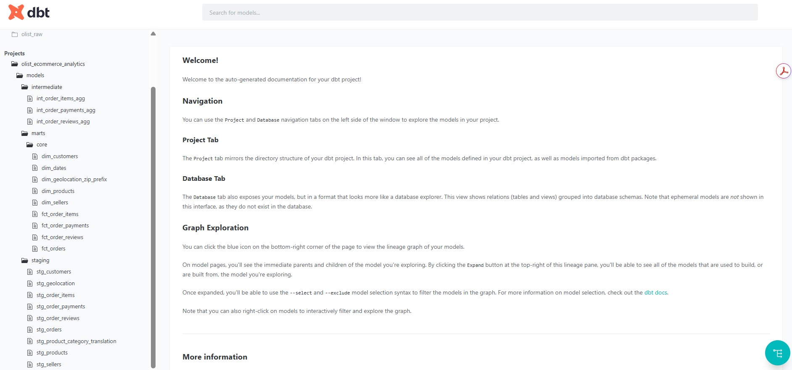
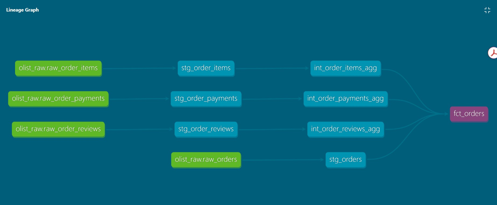
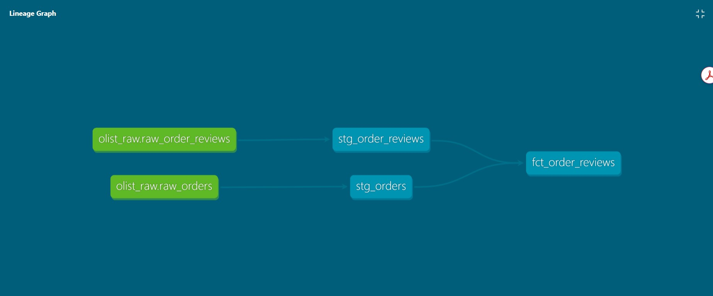
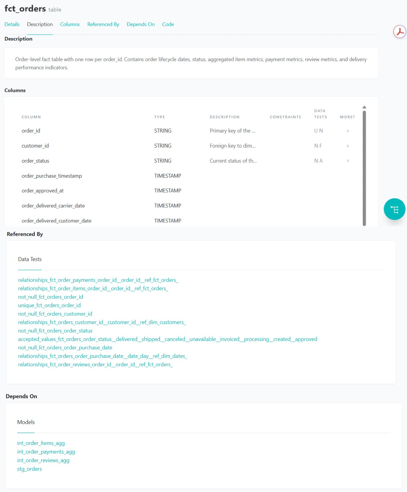

# Olist E-Commerce Analytics & Pipeline Monitoring Portal

## Overview

This project builds an e-commerce analytics pipeline on the Olist Brazilian E-Commerce dataset.

It covers the main path from raw data to analytics tables, scheduled dbt execution, pipeline monitoring, rule-based quality review, and window-based processing control.

Current implementation includes:

- BigQuery raw, staging, intermediate, marts, monitoring, and control datasets
- dbt models, tests, documentation, and lineage
- dimensional models for orders, customers, sellers, products, payments, items, and reviews
- Dockerized dbt execution on Google Cloud Run Jobs
- Cloud Scheduler for the existing scheduled dbt job
- append-only monitoring history built from dbt artifacts
- deterministic pipeline checks R001-R006
- window and watermark control with retry and audit history
- exact correlation from a control attempt to its monitoring run

The operational and analytics portal is the next M10 area. Replay and backfill remain planned for M11.

---

## Current status

| Milestone | Status | Main result |
|---|---:|---|
| M1 - Project Setup & Source Understanding | Completed | Repository structure and source review |
| M2 - BigQuery Raw Layer | Completed | 9 source files loaded to `olist_raw` |
| M3 - Staging Layer Planning | Completed | Staging rules and source mapping |
| M4 - dbt Staging Layer | Completed | 9 staging views and 39 tests |
| M5 - Dimensional Modeling / Analytics Marts | Completed | Dimensions, facts, intermediate models, and dbt docs |
| M6 - Project Documentation Cleanup | Completed | README, architecture, and project showcase cleanup |
| M7 - Cloud Orchestration | Completed | Docker, Cloud Run Job, and Cloud Scheduler |
| M8 - Pipeline Monitoring | Completed | Six append-only monitoring tables from dbt artifacts |
| M9 - Pipeline Quality Reviewer | Completed | Deterministic rules R001-R006 and optional Vertex AI explanations |
| M10 U1 - Window / Watermark Control | Completed | Window state, retries, audit history, exact M8/M9 run correlation, and BigQuery CAS protection |
| M10 Portal / Analytics | In progress | Operational UI and geospatial analytics |
| M11 - Replay / Backfill / Recovery | Planned | Historical replay, backfill, resume, and consistency checks |

M10 U1 real validation was completed on **2026-08-15**.

---

## Tech stack

| Area | Tools |
|---|---|
| Data warehouse | Google BigQuery |
| Transformation | dbt Core, dbt-bigquery |
| Modeling | Dimensional modeling, star schema |
| Data quality | dbt tests and deterministic review rules |
| Monitoring | dbt artifacts, Python, BigQuery |
| Window control | Python, BigQuery transactions, compare-and-set version checks |
| Cloud execution | Google Cloud Run Jobs, Cloud Scheduler |
| Containerization | Docker, Artifact Registry |
| Optional explanation | Vertex AI |
| Planned portal | Next.js, React, TypeScript |
| Planned maps | CARTO, deck.gl |
| Workflow | Git, GitHub Projects |

---

## Architecture

The project has three main paths.

### 1. Business analytics path

```text
Olist CSV files
        ↓
olist_raw
        ↓
olist_staging
        ↓
olist_intermediate
        ↓
olist_marts
        ↓
BI / analytics consumers
```

### 2. Monitoring and review path

```text
dbt build
        ↓
manifest.json + run_results.json
        ↓
dbt docs generate
        ↓
catalog.json
        ↓
M8 artifact parser and loader
        ↓
olist_monitoring
        ↓
M9 deterministic reviewer
        ↓
rule results and findings
        ↓
optional Vertex AI explanation
```

### 3. M10 window-controlled path

```text
olist_control
        ↓
claim next [start, end) window
        ↓
run dbt with window variables
        ↓
windowed transactional facts
        ↓
M8 monitoring run
        ↓
control_attempt_id → exact monitoring_run_id
        ↓
M9 exact-run review
        ↓
success: advance watermark
failure: keep watermark and retry same window
```

The current Cloud Scheduler configuration still starts the Cloud Run Job through `run_dbt_job.sh`. That path can run in full-history compatibility mode. The M10 controller has been validated as a window-controlled runtime, but the scheduled Cloud Run entry point has not yet been switched to the controller.

Detailed documents:

- [`docs/architecture.md`](docs/architecture.md)
- [`docs/m10_window_control.md`](docs/m10_window_control.md)
- [`docs/metadata_refresh.md`](docs/metadata_refresh.md)
- [`docs/orchestration.md`](docs/orchestration.md)
- [`docs/m9_expert_system_closing.md`](docs/m9_expert_system_closing.md)

---

## Warehouse layers

| Layer | Purpose | Example objects |
|---|---|---|
| Raw | Keep source-aligned data | `raw_orders`, `raw_order_items`, `raw_products` |
| Staging | Clean, rename, cast, and standardize | `stg_orders`, `stg_order_items`, `stg_products` |
| Intermediate | Reusable order-level logic and current-window order set | `int_orders_windowed`, `int_order_items_agg` |
| Marts | Analytics-ready dimensions and facts | `fct_orders`, `dim_customers`, `dim_products` |
| Monitoring | Append-only pipeline history | `pipeline_runs`, `test_run_results`, `model_lineage_edges` |
| Control | Current processing state and append-only state events | `pipeline_control_state`, `pipeline_window_events` |

---

## Source data

The project uses 9 Olist source files:

- customers
- geolocation
- orders
- order items
- order payments
- order reviews
- products
- sellers
- product category translation

The local source files are ignored by Git.

BigQuery raw tables:

- `raw_customers`
- `raw_geolocation`
- `raw_orders`
- `raw_order_items`
- `raw_order_payments`
- `raw_order_reviews`
- `raw_products`
- `raw_sellers`
- `raw_product_category_translation`

---

## dbt models

### Staging

The staging layer contains 9 source-aligned views.

Its job is intentionally small:

- basic cleaning
- type casting
- naming cleanup
- stable source interfaces
- source-level tests

### Intermediate

The intermediate layer contains:

- `int_orders_windowed`
- `int_order_items_agg`
- `int_order_payments_agg`
- `int_order_reviews_agg`

`int_orders_windowed` is the M10 transaction-window anchor.

When a control window is supplied, it filters `stg_orders` with a half-open range:

```text
window_start <= order_purchase_timestamp < window_end
```

The matching order IDs are then used to limit items, payments, and reviews to the same order set.

### Marts

Dimensions:

- `dim_customers`
- `dim_sellers`
- `dim_products`
- `dim_geolocation_zip_prefix`
- `dim_dates`

Facts:

- `fct_orders`
- `fct_order_items`
- `fct_order_payments`
- `fct_order_reviews`

The dimensions remain full-history tables. The four fact models are incremental `MERGE` models with stable unique keys.

```text
full-history context
        ↓
dimensions

stg_orders
        ↓
int_orders_windowed
        ↓
current order IDs
   ↙      ↓       ↘
items  payments  reviews
   ↘      ↓       ↙
windowed fact rows
        ↓
incremental MERGE
```

This keeps reference data simple while allowing the transactional path to move one window at a time.

---

## Dimensional model

### Dimensions

| Model | Grain | Key |
|---|---|---|
| `dim_customers` | One row per customer | `customer_id` |
| `dim_sellers` | One row per seller | `seller_id` |
| `dim_products` | One row per product | `product_id` |
| `dim_geolocation_zip_prefix` | One row per zip prefix | `geolocation_zip_code_prefix` |
| `dim_dates` | One row per date | `date_day` |

### Facts

| Model | Grain | Key |
|---|---|---|
| `fct_orders` | One row per order | `order_id` |
| `fct_order_items` | One row per order item | `order_item_key` |
| `fct_order_payments` | One row per payment sequence | `order_payment_key` |
| `fct_order_reviews` | One row per review and order | `review_key` |

Two source details required explicit handling:

- `review_id` is not unique by itself, so `fct_order_reviews` uses `review_id + order_id`.
- geolocation has several coordinate rows per zip prefix, so the dimension keeps representative coordinates at zip-prefix grain.

---

## Data quality

The project uses repeatable checks rather than manual inspection alone.

Examples:

- `not_null`
- `unique`
- `relationships`
- `accepted_values`
- explicit model grain checks
- M9 status and history rules

Historical milestone validation:

```text
M4 staging tests:              39 PASS
M5 intermediate + marts:      67 PASS
M8 cloud build:              115 PASS
```

Current M10 validation build:

```text
22 models
96 dbt tests
118 / 118 PASS
```

Current Python unit-test inventory:

```text
M10 window controller:        52 tests
M8 monitoring-run resolver:    5 tests
M9 pipeline reviewer:         53 tests
                              --------
Total:                       110 tests
```

The older M8 counts remain useful as historical evidence. They are not the current model/test count after the M10 window model was added.

---

## M7 cloud orchestration

M7 deployed the dbt job to Google Cloud.

```text
Cloud Scheduler
        ↓
Cloud Run Job
        ↓
Docker container
        ↓
run_dbt_job.sh
        ↓
BigQuery
```

The existing Scheduler and Cloud Run path was validated with manual and scheduled executions.

See:

- [`docs/orchestration.md`](docs/orchestration.md)
- [`docs/gcp_orchestration_commands.md`](docs/gcp_orchestration_commands.md)

---

## M8 pipeline monitoring

M8 converts dbt artifacts into append-only BigQuery records.

Artifact sources:

| Artifact | Main use |
|---|---|
| `manifest.json` | Models, tests, sources, columns, dependencies |
| `run_results.json` | Execution status, failures, and runtime |
| `catalog.json` | Warehouse relation and column metadata |

Monitoring tables:

| Table | Grain |
|---|---|
| `pipeline_runs` | One row per monitoring run |
| `model_run_results` | One row per model execution per run |
| `test_run_results` | One row per test execution per run |
| `model_metadata_snapshots` | One row per model per run |
| `model_column_snapshots` | One row per model/source column per run |
| `model_lineage_edges` | One row per dependency edge per run |

M10 added `control_attempt_id` to `pipeline_runs`. This allows one window-control attempt to resolve its exact monitoring run instead of reading a generic "latest run".

---

## M9 pipeline quality reviewer

M9 reads monitoring history and evaluates six deterministic rules:

```text
R001 - Pipeline Run Unsuccessful
R002 - Model Execution Non-Success
R003 - Test Result Non-Passing
R004 - Model Missing from Current Run
R005 - Row-Count Anomaly
R006 - Runtime Regression
```

Each rule returns:

```text
PASS
TRIGGERED
NOT_EVALUATED
```

`NOT_EVALUATED` keeps missing or unusable evidence visible. It is not converted to a pass.

Historical rules use comparable successful runs with the same `job_name` and `environment`. Where needed, the baseline uses the median of up to five prior runs.

Vertex AI is optional. It can explain triggered findings, but it cannot create findings or change the deterministic rule result.

M10 window-controlled mode resolves the exact M8 `monitoring_run_id` for the current control attempt and runs M9 against that run.

---

## M10 U1 window and watermark control

M10 U1 adds explicit processing state in BigQuery.

Control tables:

```text
olist_control.pipeline_control_state
olist_control.pipeline_window_events
```

Main states:

```text
IDLE
RUNNING
FAILED
WAITING_RETRY
QUARANTINED
```

Current runtime supports normal execution and retry.

`QUARANTINED` exists in the state model, but automatic quarantine and release are not part of U1.

### Success path

```text
IDLE
  ↓ claim window
RUNNING
  ↓ workload succeeds
IDLE
  ↓
watermark advances to the completed window end
```

### Failure and retry path

```text
RUNNING
  ↓ workload fails
FAILED
  ↓ retry requested
WAITING_RETRY
  ↓ new attempt, same window
RUNNING
```

A failed attempt does not advance the watermark.

Each retry:

- keeps the same window
- gets a new `attempt_id`
- increments `attempt_number`
- stores `retry_of_attempt_id`

The controller writes state and the matching audit event in one BigQuery transaction. A `control_version` compare-and-set check rejects stale writers.

Real validation showed two failed attempts followed by a successful third attempt for the same window. The watermark moved only after the successful attempt.

See [`docs/m10_window_control.md`](docs/m10_window_control.md).

---

## dbt docs and lineage

Useful local commands:

```bash
cd dbt
dbt docs generate
dbt docs serve --port 8081
```

Screenshots:

### Project overview



### `fct_orders` lineage



### `fct_order_reviews` lineage



### Marts tests



---

## Repository structure

```text
.
├── assets/
├── bi/
├── data/
├── dbt/
│   ├── control/
│   │   ├── bootstrap_window_control.py
│   │   ├── run_window_controller.py
│   │   └── window_controller/
│   ├── models/
│   │   ├── staging/
│   │   ├── intermediate/
│   │   └── marts/
│   ├── monitoring/
│   │   ├── artifact_parser.py
│   │   ├── load_artifacts_to_bigquery.py
│   │   ├── monitoring_run_resolver.py
│   │   ├── resolve_monitoring_run.py
│   │   └── reviewer/
│   ├── sql/
│   │   ├── control/
│   │   └── monitoring/
│   ├── Dockerfile
│   ├── profiles.yml.template
│   └── run_dbt_job.sh
├── docs/
├── metadata/
├── portal/
└── sql/
```

---

## Local usage

### Standard dbt development

```bash
cd dbt
dbt debug
dbt build
```

### Window-control unit tests

From the project root:

```bash
python -m unittest discover \
  -s dbt/control/window_controller/tests \
  -t dbt/control \
  -v
```

### Initialize control state

Initialization is explicit and should be done once per pipeline/environment pair.

```bash
python dbt/control/bootstrap_window_control.py \
  --project-id "$DBT_PROJECT_ID" \
  --pipeline-name olist-dbt-build-job \
  --environment validation \
  --location EU
```

### Run one validation window

```bash
python dbt/control/run_window_controller.py \
  --project-id "$DBT_PROJECT_ID" \
  --pipeline-name olist-dbt-build-job \
  --environment validation \
  --dbt-dataset olist_validation \
  --location EU \
  --initial-start 2016-09-04T00:00:00+00:00 \
  --window-size-hours 24
```

### Retry the current failed window

```bash
python dbt/control/run_window_controller.py \
  --project-id "$DBT_PROJECT_ID" \
  --pipeline-name olist-dbt-build-job \
  --environment validation \
  --dbt-dataset olist_validation \
  --location EU \
  --retry
```

Non-production controller runs must use an isolated dbt dataset instead of the default `olist` dataset.

---

## Current boundary

Implemented now:

- layered BigQuery warehouse
- dbt transformations and tests
- dimensional marts
- dbt docs and lineage
- scheduled Cloud Run dbt job
- append-only monitoring history
- deterministic M9 review rules
- optional explanation for triggered findings
- M10 window and watermark control
- retry attempts and audit history
- exact control-attempt to monitoring-run correlation
- BigQuery compare-and-set protection

Not implemented yet:

- switching the existing Cloud Scheduler / Cloud Run entry point to `run_window_controller.py`
- M10 operational portal
- M10 analytics and geospatial UI
- automatic retry limits and automatic quarantine policy
- M11 replay and multi-window backfill
- M11 resume and historical recovery workflows
- alert delivery

---

## Next work

### M10 portal and analytics

The next M10 work will add a small operational and analytics portal.

Planned stack:

```text
Next.js + React + TypeScript
BigQuery
CARTO + deck.gl
```

The first analytics slice will use a state-level Brazil aggregate and link map selection to KPIs, trends, and detail views.

### M11 replay and recovery

M11 will focus on controlled historical processing:

- replay one window
- backfill several windows
- resume after failure
- keep writes idempotent
- compare replay and incremental results
- keep replay control separate from the normal forward watermark

---

## Project approach

The project is built milestone by milestone.

The main rules are simple:

- keep each milestone small enough to verify
- make data grain and state changes explicit
- validate before moving on
- keep historical monitoring records instead of overwriting them
- use deterministic checks for pass/fail decisions
- use optional model explanations only after the facts are known
- keep future work separate from completed work
