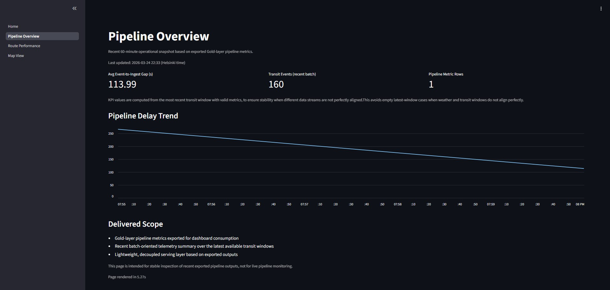
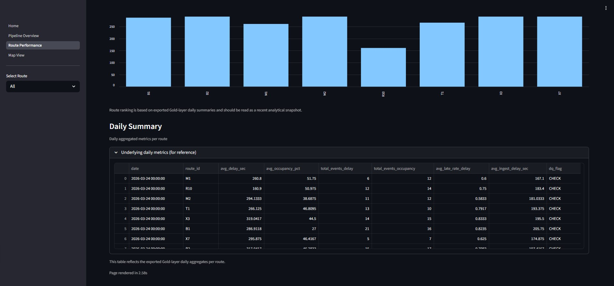
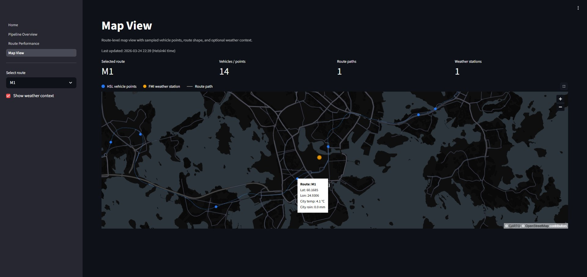

# Public Transport Telemetry & Weather Impact Pipeline

## Live Demo

Dashboard (Render):  
https://transport-telemetry-dashboard.onrender.com

The dashboard reads precomputed parquet outputs and reflects recent pipeline runs.

Tip:  
Select a route and toggle weather context in the Map View to explore how external signals relate to transport behavior.

---

## Summary

A production-style telemetry pipeline that integrates transport signals and weather data into a unified event model, with a focus on reliability, observability, and simple deployment.

The system follows a layered architecture (Bronze → Silver → Gold → Serving → Dashboard) and delivers stable, queryable outputs for monitoring and analysis.

---

## System Overview

A lightweight, production-oriented data pipeline focused on:

- reliable data integration  
- simple and consistent aggregation logic  
- stable outputs for downstream use  

This project models a telemetry pipeline where operational signals and external data (weather) are integrated into a unified event flow, producing queryable metrics for monitoring and analysis.

The goal is not complexity, but clarity, maintainability, and realistic engineering trade-offs.

---

## Architecture

The pipeline follows a layered structure:

**Bronze → Silver → Gold → Serving → Dashboard**

Each layer has a clear responsibility:

- **Bronze** — append-only ingestion and raw event storage  
- **Silver** — windowed aggregation and data quality handling  
- **Gold** — KPI modeling and pipeline health metrics  
- **Serving** — exported parquet + Azure Blob Storage  
- **Dashboard** — Streamlit-based visualization layer  


---

## Dashboard preview

### Pipeline Overview

Recent operational snapshot showing ingestion delay trends and pipeline health metrics.



---

### Route Performance

Route-level KPIs and daily summaries derived from aggregated Gold-layer outputs.



---

### Map View

Visualizes route geometry, sampled vehicle positions, and optional weather context (FMI).

- Route geometry is derived from HSL GTFS reference data
- Weather observations are integrated from FMI API
- Enables spatial exploration of operational signals and external conditions

The map layer is enriched with **HSL GTFS route reference data**, providing realistic route geometry and spatial context.



---

## Serving & Deployment

The pipeline follows a decoupled serving design:

GitHub Actions → export_gold → Azure Blob → Streamlit (Render)

- Pipeline execution is scheduled via GitHub Actions
- Gold outputs are exported as parquet files
- Files are uploaded to Azure Blob Storage
- The Streamlit dashboard reads precomputed outputs

This design avoids direct database dependencies and ensures a stable, low-maintenance system. This reduces coupling between pipeline execution and data consumption.

---

## Design Decisions

This project is intentionally designed to remain simple, predictable, and production-friendly.  
The focus is on **clear trade-offs and operational stability**, rather than system complexity.

---

### Append-only ingestion

The pipeline uses an append-only ingestion strategy to ensure reproducibility and simplify debugging.

This avoids mutation logic and keeps the data flow predictable across runs.

---

### Unified event model

All inputs (telemetry and weather) are normalized into a shared event schema.

This simplifies downstream aggregation and processing, at the cost of stricter schema discipline and upfront modeling.

---

### Micro-batch processing over streaming

Micro-batch processing is chosen instead of real-time streaming to reduce infrastructure complexity.

This keeps the system lightweight while preserving a clear migration path to structured streaming if needed.

---

### Precomputed outputs (parquet)

The dashboard reads precomputed parquet outputs rather than querying live systems.

This improves reliability, removes runtime dependencies, and ensures consistent performance.

---

### Decoupled serving layer

The serving layer is separated from the pipeline using parquet outputs stored in Azure Blob Storage.

This enables:

- simple deployment  
- low operational overhead  
- clear separation between data production and consumption  

---

### Observability as data

Pipeline health signals (freshness, lag, volume, duplicates) are modeled as queryable tables instead of logs.

This allows:

- SQL-based inspection  
- easier debugging  
- consistent monitoring logic  

---

### Lightweight orchestration

GitHub Actions is used for scheduling and execution instead of heavier orchestration tools.

This keeps the system simple while still supporting automation and reproducibility.

---

## Handling imperfect data

Real-world data sources rarely align perfectly.

For example:

- telemetry and weather signals arrive at different times  
- some aggregation windows contain only partial data  

Instead of enforcing strict alignment upstream, mismatches are handled at the presentation layer.

This keeps the pipeline logic simple while still producing usable and stable outputs.

---

## Data sources

- **Simulated telemetry data (synthetic transit signals)**  
  Represents transport signals such as delay and occupancy  

- **FMI Weather API**  
  Provides real observational weather data  

- **HSL GTFS reference data**  
  Used for route geometry and map context  

Telemetry is simulated intentionally to focus on pipeline design rather than data collection.

---

## Event model

All inputs are transformed into a shared structure.

Core fields:

- `event_time` — when the event occurred  
- `ingest_time` — when the event was processed  
- `source` — telemetry or weather  
- `metric` — type of measurement  
- `value` — numeric value  
- `unit` — measurement unit  
- `attrs` — flexible metadata (e.g. route_id)  

This enables consistent aggregation and simple schema evolution.

---

## Data layers

### Bronze

- append-only raw events  
- minimal transformation  
- acts as the system of record  

---

### Silver

- event-time windowed aggregation  
- route-level and time-based metrics  
- data quality checks (nulls, duplicates, counts)  
- ingestion latency metrics  

---

### Gold

- final metrics for dashboards  
- route KPIs (window + daily)  
- pipeline health metrics (freshness, lag, volume)  

Outputs are exported as parquet files for stable downstream use.

---

## Dashboard

The Streamlit dashboard provides three views:

- **Pipeline Overview**  
  pipeline health and ingestion delay trends  

- **Route Performance**  
  route-level KPIs and daily summaries  

- **Map View**  
  route geometry, vehicle points, and weather context  

The dashboard is designed for clarity and stability rather than heavy interactivity.

---

## Scheduling

Pipeline execution is handled using GitHub Actions.

Note:  
Execution timing is best-effort and may vary depending on GitHub runner availability.

Workflows:

- `telemetry-refresh.yml` — pipeline execution  
- `keepalive_telemetry.yml` — dashboard keepalive  
- `keepalive_nyc.yml` — legacy project keepalive  

Location:

```bash
.github/workflows/
```

---

## Repository structure

```bash
.github/workflows/
  telemetry-refresh.yml        # scheduled pipeline runs
  keepalive_telemetry.yml     # keep Render service awake

Projects/Public-Transport-Telemetry-Pipeline/

  data/
    bronze/
      bronze_events.csv       # raw append-only events
    silver/
      silver_transit_metrics.csv  # aggregated metrics
    gold/
      hsl/                    # route geometry (GTFS)
      weather/                # weather observations
    output/
      gold_route_daily.parquet
      gold_route_window.parquet
      pipeline_metrics.parquet
    external/gtfs_hsl/        # GTFS reference data

  src/pipeline/
    bronze.py
    silver.py
    gold.py
    hsl.py
    config.py
    setup.py

  scripts/
    run_pipeline.py
    export_gold.py
    upload_outputs_to_blob.py

  streamlit_app/
    Home.py
    pages/
      1_Pipeline_Overview.py
      2_Route_Performance.py
      3_Map_View.py
    utils/
      load_data.py
      data_access.py
      maps.py

  tests/tools/
    inspect_*.py
    test_*.py

  notebooks/mvp/
  docs/
    architecture.png

README.md
requirements.txt
.gitignore
```

---

## How to run

Run full pipeline:

```bash
python scripts/run_pipeline.py --layer full
```

Run individual layers:

```bash
python scripts/run_pipeline.py --layer bronze
python scripts/run_pipeline.py --layer silver
python scripts/run_pipeline.py --layer gold
```

Inspect outputs:

```bash
python tests/tools/inspect_gold.py
```

---

## Scope

This project focuses on core data engineering patterns:

- Data integration
- Aggregation logic
- Pipeline reliability
- Monitoring outputs

It intentionally avoids unnecessary complexity.

---

## Possible Extensions

Potential extensions include:

- Structured streaming for lower latency
- Backfill and reprocessing support
- Automated alerting and anomaly detection
- Additional external signals (e.g. traffic data)

---

## License

This project is covered by the MIT License at the repository root.
