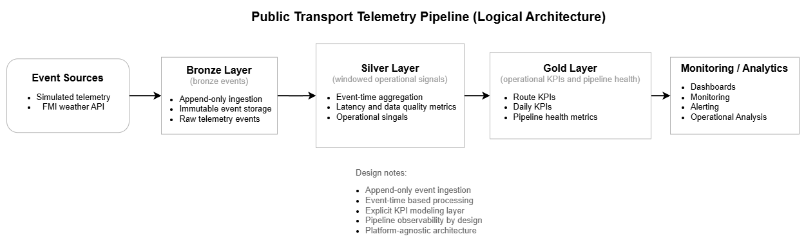

# Public Transport Telemetry & Weather Impact Pipeline (MVP)

A minimal data pipeline focused on reliability, observability, and pragmatic design trade-offs.

Telemetry pipeline that unifies operational events and external signals (weather) into a single event stream and transforms them into monitoring-ready metrics.

Designed to demonstrate reliable data pipeline patterns: append-only ingestion, event-time aggregation, and table-based observability.

Implemented as a modular, script-driven system with a path toward production environments.

This MVP focuses on data modeling, aggregation, and pipeline observability. Predictive modeling and accuracy optimization are intentionally out of scope.

---

## Problem

Public transport operations are sensitive to external conditions such as weather, but telemetry signals and external observations are often processed separately or analyzed offline.

This project demonstrates how event-based telemetry and weather observations can be ingested into a unified pipeline and transformed into operational monitoring signals.

The goal is to model a realistic telemetry pipeline structure that supports operational visibility, KPI reporting, and pipeline health monitoring.

---

## Architecture

The pipeline follows a layered Bronze → Silver → Gold architecture, separating raw ingestion, operational aggregation, and monitoring-ready outputs.



---

## Design decisions (pragmatic trade-offs)

- Append-only Bronze:
  avoids mutation complexity and ensures reproducibility of historical data

- Unified event model:
  simplifies cross-source aggregation at the cost of stricter schema discipline

- Micro-batch instead of streaming:
  chosen to reduce infrastruture complexity while keeping a migration path open

- Observability as tables:
  makes pipeline health queryable instead of replying on logs

---

### Layers (high-level)

- **Bronze**  
  Append-only raw events (telemetry and weather) stored with minimal transformation.  
  This layer acts as the immutable system of record.

- **Silver**  
  Windowed aggregations and curated operational signals using event-time processing.  
  Produces consistent, validation-ready operational metrics.

- **Gold**  
  Operational KPI tables and pipeline health metrics designed for dashboards and monitoring.

- **Ops / Health**  
  Observability metrics such as ingestion freshness, event lag, duplicate ratios, and volume trends.

---

## Data sources

- **Simulated telemetry events**  
  Operational signals such as delay, headway, and load metrics.

- **FMI Weather API**  
  Observational weather data ingested into the same unified event model.

Telemetry is simulated in this MVP to focus on pipeline design, aggregation, and observability rather than data collection.

---

## Event model

All sources are normalized into a shared event schema.

Core fields:

- `event_time` — timestamp when the event occurred  
- `ingest_time` — timestamp when the event was ingested  
- `source` — telemetry or weather  
- `metric` — metric name (e.g., temperature, precipitation, delay_seconds)  
- `value` and `unit` — numeric measurement  
- `attrs` — extensible attribute map for schema evolution  

This unified model enables consistent aggregation, flexible schema evolution, and observability metrics such as ingestion lag and freshness.

---

## Silver metrics (15-minute windows)

The Silver layer aggregates events into fixed event-time windows.

Example outputs:

- `silver_weather_metrics`  
  Aggregated weather observations per window

- `silver_transit_metrics` (planned extension)  
  Aggregated operational telemetry metrics per route and window

Validation checks include:

- row count sanity checks  
- duplicate detection  
- null and missing key checks  
- event-time range validation  

---

## Gold outputs

The Gold layer provides monitoring-ready operational metrics.

These tables are designed for:

- dashboard visualization  
- operational monitoring  
- pipeline health analysis  

Outputs include:

- aggregated operational KPIs  
- ingestion freshness metrics  
- ingestion lag metrics  
- duplicate ratios and volume tracking  

These observability signals are stored as structured tables rather than logs.

---

## Pipeline health and observability

Pipeline health is treated as a first-class output.

Tracked signals include:

- ingestion freshness  
- event-time lag  
- event volume trends  
- duplicate ratios  
- missing key indicators  

These metrics enable pipeline monitoring and troubleshooting.

---

## Scope and limitations

In scope:

- append-only Bronze ingestion  
- unified event schema  
- event-time windowed aggregation  
- operational KPI modeling  
- pipeline observability metrics  

Limitations:

- No real-time streaming ingestion (micro-batch used for simplicity)  
- Simulated telemetry data (not production-grade ingestion)  
- No geospatial enrichment yet (route-level analysis only)
- Limited backfill and reprocessing logic

These trade-offs were made to keep the system lightweight and focused on core pipeline design.

---

## Repo structure

Current structure:

```bash
scripts/
  run_pipeline.py        # pipeline runner

src/pipeline/
  config.py             # configuration
  setup.py              # spark session setup
  bronze.py             # ingestion layer
  silver.py             # aggregation layer
  gold.py               # KPI and observability layer
  validation.py         # data quality checks
  storage.py            # I/O abstraction

streamlit_app/          # optional dashboard layer

tests/
  inspect_bronze.py
  inspect_silver.py
  inspect_gold.py       # lightweight validation and inspection scripts

docs/
  architecture.png      # pipeline architecture diagram

README.md               # project documentation
```  

---

## Implementation approach

The pipeline is implemented as a modular, script-driven system:

- Each layer (Bronze, Silver, Gold) is isolated into its own module
- A single runner orchestrates execution for reproducibility
- The structure is designed to support future migration to scheduled jobs or cloud environments

The notebook version is retained only for initial exploration and reference.

---

## How to run

Run the full pipeline:

```bash
python scripts/run_pipeline.py --layer full
```

Run individual layers for debugging:
```bash
python scripts/run_pipeline.py --layer bronze
python scripts/run_pipeline.py --layer silver
python scripts/run_pipeline.py --layer gold
```

Inspect outputs:
```bash
python tests/inspect_bronze.py
python tests/inspect_silver.py
python tests/inspect_gold.py
```

Notes:
- Bronze ingestion currently runs in append mode during normal execution
- Full runs rebuild downstream Silver and Gold tables after Bronze ingestion
- Weather-related outputs are expected to remain empty until FMI ingestion is connected to the main runner

The pipeline is designed to remain platform-agnostic and migration-ready.

---

## Roadmap

Possible extensions:

- real telemetry integration  
- streaming ingestion using Structured Streaming  
- geospatial enrichment  
- automated monitoring and alerting  

---

## Portability

The pipeline is structured to be migration-ready to managed environments such as Azure Databricks.

Key design choices supporting portability:

- unified event model  
- append-only ingestion pattern  
- clear layer separation  
- event-time aggregation  

---

## License

This project is covered by the MIT License at the repository root.