# Public Transport Telemetry Pipeline with Weather Context

## Live Demo

**Dashboard (Render):**  
https://transport-telemetry-dashboard-vs4l.onrender.com

This dashboard reads precomputed Gold-layer parquet outputs from Azure Blob Storage and presents the latest exported snapshot.

> Note: This is a scheduled snapshot dashboard, not a live operations monitoring system.

Render free-tier cold starts may still occur. External uptime checks are used to reduce startup delay, but the dashboard is not designed as an always-on production service.

---

## Summary

A production-oriented public transport telemetry pipeline with weather context, built as a scheduled snapshot data product.

The project uses Spark and Delta-style Bronze/Silver/Gold processing to generate route-level metrics, pipeline health indicators, and dashboard-ready outputs. The refresh workflow is containerized with Docker and scheduled through Azure Container Apps Jobs. Gold-layer parquet files are exported to Azure Blob Storage and served by a Streamlit dashboard deployed on Render.

The scheduled refresh also generates data quality and source compatibility reports. These reports are uploaded as read-only JSON artifacts to Azure Blob Storage and displayed in the dashboard with local fallback for development.

---

## What this project demonstrates

- Spark / Delta-style Bronze -> Silver -> Gold pipeline design
- Event-time and ingest-time separation for telemetry data
- Route-level KPI modeling and pipeline health metrics
- HSL route geometry and FMI weather station context
- Data quality validation for exported Gold-layer outputs
- Source compatibility validation for controlled HSL/FMI sample snapshots
- Azure Blob Storage as a decoupled serving layer
- Azure Container Apps Jobs as the primary scheduled refresh path
- Azure Databricks Job as an optional managed Spark validation path
- Dockerized batch execution with Azure Container Registry image deployment
- Azure Function metadata heartbeat for lightweight dashboard transparency
- Optional OpenAI explanation layer over precomputed rule-based facts
- Render dashboard deployment with external uptime checks for cold-start reduction
- Cost-aware portfolio deployment decisions

---

## Engineering Signals

I kept the project intentionally small, so the main focus stays on pipeline boundaries, refresh ownership, serving design, and cost control.

It shows how to:

- separate pipeline execution from dashboard serving
- model Bronze/Silver/Gold responsibilities clearly
- expose deterministic Gold-layer outputs for downstream consumption
- keep validation as generated artifacts owned by the scheduled refresh workflow
- keep AI explanation outside the metric calculation path
- use Azure Blob Storage as a lightweight serving boundary
- validate an optional Azure Databricks execution path without keeping compute always on
- make refresh behavior transparent through a lightweight Azure Function metadata heartbeat
- document cost-aware deployment trade-offs for a personal portfolio environment
- run the refresh workflow as a containerized batch job instead of always-on infrastructure
- use Azure Container Apps Jobs as a cost-aware scheduler for portfolio-scale refreshes

---

## Project Preview

A lightweight, production-oriented telemetry pipeline simulating public transport operations in the Helsinki region.

The project focuses on data flow clarity, engineering trade-offs, and delivery of stable, query-ready outputs rather than feature complexity.

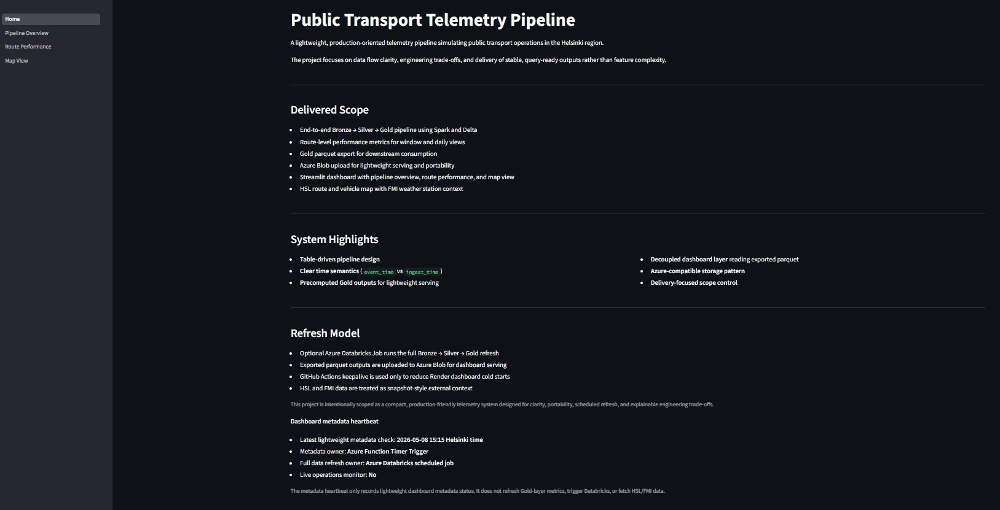

> **Preview highlights:** delivered scope, refresh model, serving design, and the lightweight metadata heartbeat displayed directly on the dashboard home page.

---

## Dashboard Preview

### 1. Home / System Overview

The Home page is shown in the project preview above. It summarizes the delivered scope, core system highlights, and the refresh ownership model. It also surfaces the lightweight Azure Function metadata heartbeat used to improve dashboard transparency.

---

### 2. Pipeline Overview

The Pipeline Overview page presents Gold-layer pipeline metrics, freshness information, and a delivery-oriented summary of the latest exported snapshot.


---

### 3. Route Performance

The Route Performance page displays route-level KPI outputs designed for analysis-ready consumption, including selected-route metrics and recent delay trends.


---

### 4. Data Quality & Source Validation

The Data Quality page displays read-only validation reports generated during scheduled snapshot refreshes. It covers exported pipeline outputs and controlled HSL/FMI source compatibility snapshots.

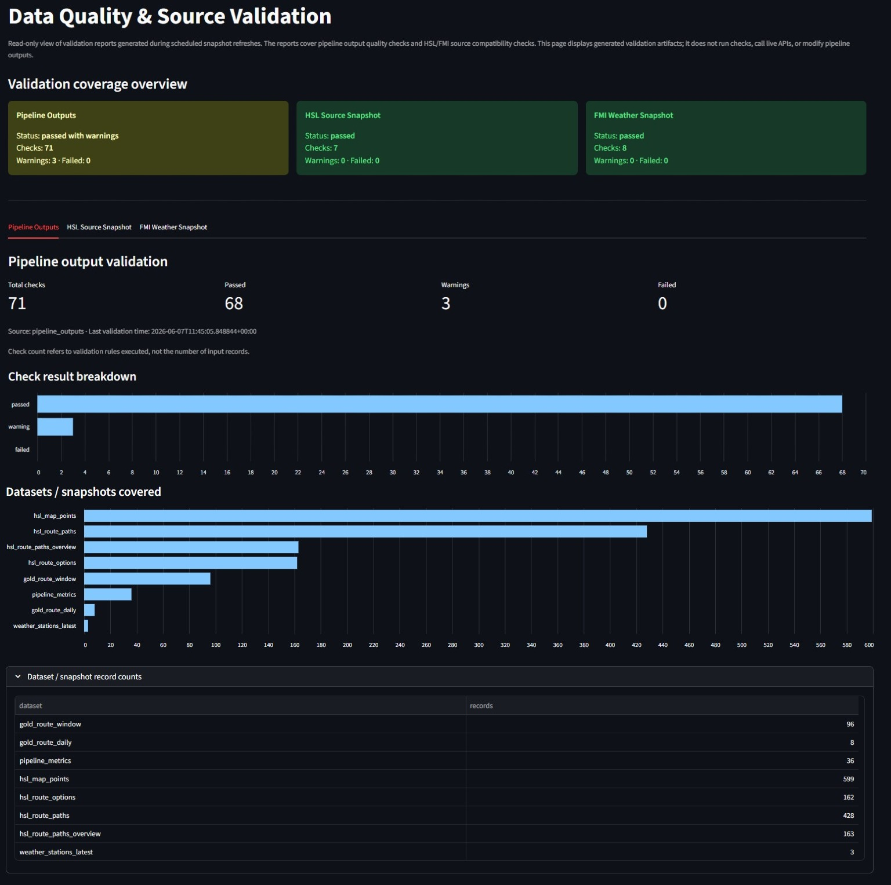

---

### 5. Map View

The Map View combines HSL route geometry, sampled vehicle points, and FMI weather station context. Weather is shown as contextual external information, not as causal impact analysis.

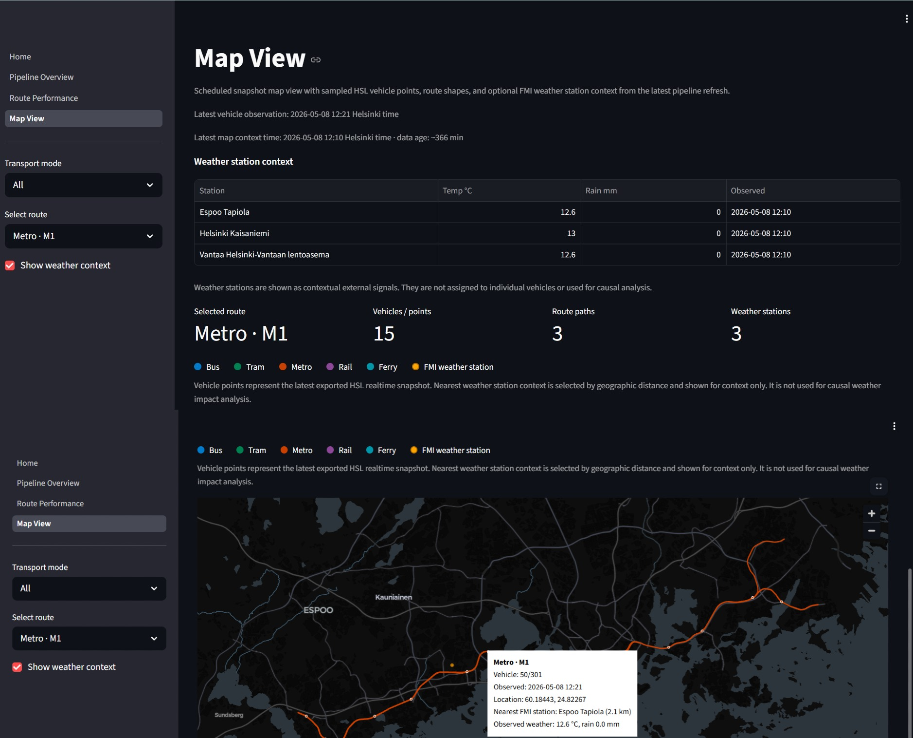

---

### 6. Architecture Overview

The architecture view summarizes the end-to-end design: containerized scheduled refresh, Bronze → Silver → Gold processing, parquet export, data quality validation, Azure Blob serving, Streamlit dashboard consumption, optional Databricks validation, optional OpenAI explanation, and lightweight metadata heartbeat.


---

## Architecture

The project follows a layered data product design:

```text
Data Sources
  ├── Simulated transport telemetry
  ├── FMI weather observations
  └── HSL GTFS route reference data

Pipeline Processing
  └── Spark / Delta-style Bronze -> Silver -> Gold layers

Cloud Execution
  ├── Azure Container Apps Job for scheduled containerized refresh
  ├── Manual Container Apps Job for validation / fallback runs
  └── Optional Azure Databricks Job for managed Spark validation

Container Image
  └── Docker image stored in Azure Container Registry

Quality Validation
  ├── Pipeline output validation for exported Gold artifacts
  ├── HSL source compatibility validation using versioned sample snapshot
  └── FMI source compatibility validation using versioned sample snapshot

Serving Layer
  ├── Exported Gold parquet outputs uploaded to Azure Blob Storage
  └── Generated quality reports uploaded to Azure Blob Storage as JSON artifacts

Dashboard Layer
  ├── Streamlit dashboard deployed on Render
  ├── Dashboard pages reading exported parquet outputs
  └── Data Quality page reading generated validation reports

Supporting Services
  ├── Azure Function metadata heartbeat
  ├── Optional OpenAI explanation layer
  └── External uptime checks + GitHub Actions best-effort keepalive
```

The dashboard is intentionally separated from the pipeline execution layer. It reads stable exported parquet files and generated validation JSON artifacts instead of querying live processing systems or running validation checks inside the UI.

---

## Refresh & Serving Model

The full data refresh is currently owned by an Azure Container Apps scheduled job.

The scheduled job runs a containerized refresh workflow:

1. Pull the pipeline image from Azure Container Registry
2. Run the Bronze -> Silver -> Gold pipeline
3. Export dashboard-ready Gold outputs as parquet files
4. Run data quality checks against exported pipeline outputs
5. Run HSL/FMI source compatibility checks against controlled versioned sample snapshots
6. Upload exported parquet files and validation JSON reports to Azure Blob Storage
7. Let the Render-hosted Streamlit dashboard read the latest exported outputs and validation artifacts

The dashboard does not execute validation logic. It displays generated validation artifacts in read-only mode, using Azure Blob Storage as the primary source and local files as a development fallback.

The scheduled job currently runs every three hours using the cron expression `0 */3 * * *`. This is used as a validation-phase refresh frequency and may be reduced for stricter cost control.

A separate manual Container Apps Job is kept for validation and fallback runs.

Azure Databricks was used as an optional managed Spark validation path. It is not used as the routine refresh scheduler and can be disabled or removed after validation for cost control.

---

## Dashboard Features

### Home

The Home page summarizes the delivered scope, system highlights, refresh model, and dashboard metadata heartbeat.

It explains the difference between:

- full data refresh
- lightweight metadata heartbeat
- dashboard serving
- keepalive behavior

### Pipeline Overview

The Pipeline Overview page shows recent Gold-layer pipeline metrics, including:

- average ingest delay
- processed event count
- data quality status
- rule-based operational snapshot
- optional AI-generated explanation

The AI explanation is generated only from precomputed dashboard facts.

### Route Performance

The Route Performance page provides route-level KPIs and recent historical context, including:

- average delay
- occupancy
- late-rate indicator
- observed event count
- route-level rule-based snapshot
- optional AI-generated explanation

These metrics are descriptive snapshot summaries, not live service alerts.

### Data Quality & Source Validation

The Data Quality page displays generated validation reports in read-only mode.

It includes:

- pipeline output validation summary
- HSL source snapshot compatibility validation
- FMI weather source snapshot compatibility validation
- dataset-level record counts
- check-level details, warnings, and metadata

The page does not run checks, call HSL/FMI live APIs, or modify pipeline outputs. In deployed mode, it reads validation JSON artifacts from Azure Blob Storage. In local development, it can fall back to files under `data/quality/reports/`.

### Map View

The Map View shows route geometry, recent vehicle points, and FMI weather station context.

It includes:

- HSL route paths from GTFS reference data
- recent vehicle point visualization
- route and transport mode selection
- FMI weather station context
- nearest weather station enrichment based on distance

Weather is used as contextual external information only. The dashboard does not infer causal weather impact.

---

## Optional AI Explanation Layer

The dashboard includes an optional OpenAI explanation layer for the Pipeline Overview and Route Performance pages.

This layer is not part of the metric calculation path. It only rewrites deterministic rule-based dashboard facts into a short plain-English explanation.

Guardrails:

- Uses only precomputed dashboard facts
- Does not inspect raw data
- Does not calculate new metrics
- Does not infer root causes
- Does not claim live monitoring
- Does not claim prediction
- Does not claim weather impact or causal analysis
- Falls back to rule-based insights when the OpenAI API key is not configured

The dashboard can show a short explanation, but the numbers still come from the Gold-layer outputs.

---

## Azure Function Metadata Heartbeat

A lightweight Azure Function Timer Trigger writes `dashboard/refresh_metadata.json` to Azure Blob Storage.

The metadata heartbeat records:

- latest metadata check time in UTC and Helsinki time
- serving layer type
- full refresh owner
- lightweight check owner
- whether the dashboard should not be treated as a live monitor

This function intentionally does not run the Spark pipeline, trigger Databricks, fetch HSL/FMI data, or refresh Gold-layer dashboard outputs.

It exists only to make the refresh model more transparent.

---

## Cost-aware Deployment Trade-offs

This is a personal portfolio deployment, so the architecture separates production-oriented design from always-on infrastructure cost.

Key trade-offs:

- Azure Container Apps Jobs are used as the primary scheduled refresh path because the workload is batch-oriented and does not require always-on compute.
- The refresh pipeline is containerized and stored in Azure Container Registry, making the execution path reproducible across local Docker and Azure.
- Azure Databricks was used to validate a managed Spark execution path, but routine scheduling was moved to Azure Container Apps Jobs to reduce fixed cloud cost exposure.
- Azure Blob Storage acts as a low-cost serving boundary between pipeline execution and dashboard consumption.
- Azure Function is used only for lightweight metadata heartbeat, not incremental data refresh or pipeline orchestration.
- Render free-tier hosting may cold start; external uptime checks reduce this but do not provide production SLA.
- GitHub Actions is retained as manual fallback and best-effort automation, not as the primary scheduler.
- Databricks was used as an optional managed Spark validation path. Routine scheduling was disabled, and the managed Databricks environment does not need to remain active after validation.

In a company production environment, this setup would typically be upgraded with managed monitoring, alerting, Key Vault or managed identity, stricter orchestration, and company-owned cloud cost controls.

---

## Data Sources

This project combines simulated transport telemetry with real external reference/context data.

### Simulated transport telemetry

The main telemetry events are synthetic and are used to model route-level operational signals such as delay, occupancy, event volume, and ingestion timing.

Telemetry is simulated intentionally. The project focuses on pipeline design, data modeling, serving architecture, and operational trade-offs rather than building a live transport data collector.

### FMI weather observations

Weather observations are fetched from the Finnish Meteorological Institute API and used as external context for the dashboard.

Weather data is not used to infer causal impact. It is included as contextual information, especially in the Map View.

### HSL GTFS route reference data

HSL GTFS reference files are used to derive route geometry and map context.

The dashboard uses this data to show route paths, sampled vehicle points, and route-level spatial context.

---

## Event Model

Inputs are normalized into a shared event-oriented structure.

Core fields:

- `event_time` — when the event occurred
- `ingest_time` — when the event was processed
- `source` — telemetry or weather
- `metric` — type of measurement
- `value` — numeric value
- `unit` — measurement unit
- `attrs` — flexible metadata such as route id, station id, or context fields

This model keeps telemetry and external context data consistent enough for downstream aggregation, while still allowing source-specific attributes to evolve.

---

## Data Layers

### Bronze

The Bronze layer stores append-only raw events with minimal transformation.

It acts as the system of record for pipeline runs and keeps debugging simple.

### Silver

The Silver layer applies event-time windowing, route-level aggregation, and basic data quality checks.

It produces intermediate metrics such as delay, occupancy, event counts, duplicate checks, and ingestion latency.

### Gold

The Gold layer produces dashboard-ready outputs.

Gold outputs include:

- route-level window KPIs
- route-level daily summaries
- pipeline health metrics
- HSL route/map parquet outputs
- FMI weather station context outputs

These outputs are exported as parquet files and uploaded to Azure Blob Storage for dashboard consumption.

Validation outputs are stored separately from Gold parquet outputs. Pipeline quality reports and source compatibility reports are generated under `data/quality/reports/` and uploaded to Azure Blob Storage under `quality/reports/`.

---

## Design Decisions

This project is intentionally designed to stay simple, explainable, and cost-aware.

The focus is not to maximize the number of services, but to show how a data pipeline can be structured around clear responsibilities, stable outputs, and realistic deployment constraints.

### Scheduled snapshot instead of live monitoring

The dashboard is designed as a scheduled snapshot view.

It presents the latest exported Gold-layer metrics and map context, but it does not claim real-time operational monitoring. This keeps the system honest, stable, and affordable for a portfolio deployment.

### Precomputed outputs instead of live queries

The dashboard reads exported parquet files from Azure Blob Storage instead of querying a live database or processing layer.

This reduces runtime dependencies and keeps dashboard performance predictable.

### Decoupled pipeline and dashboard layers

The pipeline produces data. The dashboard consumes data.

Azure Blob Storage acts as the serving boundary between those layers. This makes the dashboard easier to deploy and prevents UI availability from depending on pipeline execution.

### Read-only validation artifacts

Data quality checks are executed as part of the scheduled refresh workflow, not inside the dashboard.

The validation subsystem produces JSON artifacts for pipeline output checks and source compatibility checks. The dashboard reads these artifacts as evidence of the latest refresh quality state.

This keeps validation ownership in the batch workflow and keeps the UI read-only, lightweight, and safe.

### Container Apps Jobs for routine refresh, Databricks for validation

Azure Container Apps Jobs are used for routine scheduled refreshes because the workload is batch-oriented and can run as a short-lived container.

Azure Databricks was used to validate that the same Spark pipeline can run in a managed cloud data engineering environment. Its schedule is paused for cost control and it is retained only as an optional validation path.

### Lightweight metadata heartbeat

Azure Function is used only to write lightweight dashboard metadata.

It does not perform incremental data refresh. This avoids turning a transparency feature into an expensive or confusing orchestration layer.

### AI explanation outside the metric path

OpenAI is kept outside the data pipeline and outside the metric calculation path.

The model only receives precomputed rule-based facts and rewrites them into a short explanation. Metrics remain deterministic and explainable.

### Weather as context, not causal analysis

FMI weather data is included as external context.

The project does not infer that weather caused route delays or operational changes. This keeps the dashboard descriptive and avoids unsupported conclusions.

--- 

## Repository Structure

```text
.github/workflows/
  telemetry-refresh.yml             # manual fallback refresh workflow
  keepalive_telemetry.yml           # best-effort Render keepalive
  keepalive_nyc.yml                 # legacy NYC dashboard keepalive

Projects/Public-Transport-Telemetry-Pipeline/
  azure_function/
    function_app.py                 # Azure Function Timer Trigger metadata heartbeat
    host.json
    requirements.txt
    local.settings.json.example

  data/
    bronze/
      bronze_events.csv             # append-only raw events
    silver/
      silver_transit_metrics.csv    # aggregated transit metrics
    gold/
      hsl/                          # HSL route/map parquet outputs
      weather/                      # FMI weather station parquet outputs
      output/                       # dashboard-ready Gold parquet outputs
    external/gtfs_hsl/              # HSL GTFS reference files
    source_samples/
      hsl_vehicle_snapshot.parquet  # versioned controlled HSL source sample
      fmi_weather_snapshot.parquet  # versioned controlled FMI source sample
    quality/reports/                # generated local validation reports, not required for repo tracking

  src/pipeline/
    bronze.py                       # Bronze ingestion logic
    silver.py                       # Silver aggregation and data quality logic
    gold.py                         # Gold KPI and health metric modeling
    hsl.py                          # HSL route geometry / map data processing
    config.py
    setup.py

  src/quality/
    validation_report.py            # report models and JSON serialization
    contracts.py                    # expected schemas and validation contracts
    check_utils.py                  # reusable validation check helpers
    pipeline_quality.py             # pipeline output quality checks

  scripts/
    run_pipeline.py                 # local pipeline runner
    run_databricks_refresh.py       # Databricks Job wrapper
    run_container_refresh.py        # Azure Container Apps Job entrypoint
    export_gold.py                  # export Gold outputs to parquet
    upload_outputs_to_blob.py       # upload dashboard outputs to Azure Blob
    run_quality_checks.py           # validate exported pipeline outputs
    validate_hsl_snapshot.py        # validate controlled HSL source sample
    validate_fmi_weather_snapshot.py  # validate controlled FMI source sample
    upload_quality_reports_to_blob.py # upload validation JSON artifacts to Azure Blob

  streamlit_app/
    Home.py
    pages/
      1_Pipeline_Overview.py
      2_Route_Performance.py
      3_Map_View.py
      4_Data_Quality.py
    utils/
      data_access.py
      insights.py                   # deterministic rule-based dashboard insights
      load_data.py
      maps.py
      openai_explainer.py           # optional OpenAI explanation layer
      refresh_metadata.py           # load Azure Function metadata heartbeat
      quality.py                    # Blob-first quality report loader with local fallback

  notebooks/mvp/
    00_pipeline_runner.ipynb
    00_setup_and_schema.ipynb
    10_bronze_transit_ingest.ipynb
    20_silver_transit_metrics.ipynb
    30_bronze_weather_ingest.ipynb
    40_silver_weather_metrics.ipynb
    50_gold_route_kpi_window.ipynb
    60_gold_route_kpi_daily.ipynb
    70_gold_pipeline_metrics_window.ipynb
    80_basic_visual_checks.ipynb
    90_hsl_map_mvp.ipynb

  docs/
    architecture.png
    dashboard_home.jpg
    dashboard_data_quality.jpg
    dashboard_data_quality_checks.jpg
    dashboard_pipeline_overview.jpg
    dashboard_route_performance.jpg
    dashboard_map_combined.jpg
    dashboard_pipeline_overview_ai.jpg
    dashboard_route_performance_ai.jpg
    dashboard_route_ranking_all.jpg
    databricks_successful_run.jpg
    azure_function_metadata_heartbeat.jpg
    uptimerobot_keepalive.jpg
    azure_container_apps_job.md
    containerized_refresh_validation.jpg
    aca_scheduled_job.jpg
    azure_cost_analysis_nat_gateway.jpg
    databricks_job_schedule_paused.jpg
    databricks_compute_sql_warehouse_inactive.jpg

Dockerfile
.dockerignore
README.md
requirements.txt
.gitignore
```

---

## Containerized Azure Container Apps Job Execution Path

The project includes a container refresh entrypoint:

```bash
python Projects/Public-Transport-Telemetry-Pipeline/scripts/run_container_refresh.py
```

This entrypoint runs the complete scheduled refresh workflow:

1. Run the full Bronze -> Silver -> Gold pipeline
2. Export Gold dashboard outputs
3. Generate pipeline output quality reports
4. Validate controlled HSL and FMI source sample snapshots
5. Upload exported parquet outputs to Azure Blob Storage
6. Upload generated quality reports to Azure Blob Storage

Build the Docker image locally:

```bash
docker build -t telemetry-pipeline-job .
```

Run the container locally:

```bash
docker run --rm \
  -e AZURE_STORAGE_CONNECTION_STRING="$AZURE_STORAGE_CONNECTION_STRING" \
  -e AZURE_BLOB_CONTAINER="$AZURE_BLOB_CONTAINER" \
  telemetry-pipeline-job
```

The same image is pushed to Azure Container Registry and executed by Azure Container Apps Jobs.

For detailed Azure Container Apps Job deployment commands, parameter notes, validation steps, and troubleshooting, see [`docs/azure_container_apps_job.md`](docs/azure_container_apps_job.md).

---

## How to Run Locally

Install dependencies:

```bash
pip install -r requirements.txt
```

Run the full local pipeline:

```bash
python Projects/Public-Transport-Telemetry-Pipeline/scripts/run_pipeline.py --layer full
```

Run individual layers:

```bash
python Projects/Public-Transport-Telemetry-Pipeline/scripts/run_pipeline.py --layer bronze
python Projects/Public-Transport-Telemetry-Pipeline/scripts/run_pipeline.py --layer silver
python Projects/Public-Transport-Telemetry-Pipeline/scripts/run_pipeline.py --layer gold
```

Export Gold outputs:

```bash
python Projects/Public-Transport-Telemetry-Pipeline/scripts/export_gold.py
```

Run pipeline output quality checks:

```bash
python Projects/Public-Transport-Telemetry-Pipeline/scripts/run_quality_checks.py \
  --output Projects/Public-Transport-Telemetry-Pipeline/data/quality/reports/pipeline_quality_report.json \
  --summary-output Projects/Public-Transport-Telemetry-Pipeline/data/quality/reports/latest_quality_summary.json
```

Run controlled source compatibility checks:

```bash
python Projects/Public-Transport-Telemetry-Pipeline/scripts/validate_hsl_snapshot.py \
  --input Projects/Public-Transport-Telemetry-Pipeline/data/source_samples/hsl_vehicle_snapshot.parquet \
  --output Projects/Public-Transport-Telemetry-Pipeline/data/quality/reports/hsl_source_validation_report.json \
  --summary-output Projects/Public-Transport-Telemetry-Pipeline/data/quality/reports/latest_hsl_source_summary.json

python Projects/Public-Transport-Telemetry-Pipeline/scripts/validate_fmi_weather_snapshot.py \
  --input Projects/Public-Transport-Telemetry-Pipeline/data/source_samples/fmi_weather_snapshot.parquet \
  --output Projects/Public-Transport-Telemetry-Pipeline/data/quality/reports/fmi_source_validation_report.json \
  --summary-output Projects/Public-Transport-Telemetry-Pipeline/data/quality/reports/latest_fmi_source_summary.json
```

Upload validation reports to Azure Blob Storage:

```bash
python Projects/Public-Transport-Telemetry-Pipeline/scripts/upload_quality_reports_to_blob.py
```

Upload dashboard outputs to Azure Blob Storage:

```bash
python Projects/Public-Transport-Telemetry-Pipeline/scripts/upload_outputs_to_blob.py
```

Run the Streamlit dashboard:

```bash
streamlit run Projects/Public-Transport-Telemetry-Pipeline/streamlit_app/Home.py
```

---

## Optional Azure Databricks Validation Path

The project includes a Databricks-compatible refresh wrapper:

```bash
python Projects/Public-Transport-Telemetry-Pipeline/scripts/run_databricks_refresh.py --layer full
```

During validation, this wrapper was used by an Azure Databricks Job task to run the full refresh flow:

1. Run the pipeline
2. Export Gold outputs
3. Upload dashboard-ready parquet files to Azure Blob Storage

The Databricks path reuses the same project logic as the local pipeline, while adapting runtime paths for the Databricks environment.

This path is optional for portfolio cost control. Once exported parquet outputs are available in Azure Blob Storage, the dashboard can continue serving the latest snapshot without keeping Databricks compute continuously active.

---

## Deployment Notes

### Azure Container Apps Jobs

The scheduled refresh job runs the containerized pipeline from Azure Container Registry.

Current job roles:

- `telemetry-refresh-job-scheduled` — primary scheduled refresh job
- `telemetry-refresh-job` — manual validation / fallback job

Runtime configuration:

- Image: `telemetryacr263.azurecr.io/telemetry-pipeline-job:local-v1`
- Schedule: `0 */3 * * *`
- CPU / memory: 2 vCPU / 4 Gi
- Blob credentials are injected through a Container Apps secret reference.

Required job environment variables:

- `AZURE_STORAGE_CONNECTION_STRING`
- `AZURE_BLOB_CONTAINER` or `AZURE_STORAGE_CONTAINER_NAME`

### Dashboard

The dashboard is deployed on Render and reads parquet outputs from Azure Blob Storage.

Required dashboard environment variables:

- `AZURE_STORAGE_CONNECTION_STRING`
- `AZURE_BLOB_CONTAINER`, `AZURE_STORAGE_CONTAINER_NAME`, or existing `AZURE_CONTAINER_NAME` depending on deployment configuration
- `OPENAI_API_KEY` optional
- `OPENAI_EXPLANATION_MODEL` optional

If the OpenAI API key is not configured, the dashboard still works with rule-based insights.

### Azure Function

The Azure Function writes lightweight refresh metadata to Azure Blob Storage.

Required Function App settings:

- `AzureWebJobsStorage`
- `FUNCTIONS_WORKER_RUNTIME`
- `AZURE_STORAGE_CONNECTION_STRING`
- `AZURE_CONTAINER_NAME`
- `LIGHTWEIGHT_METADATA_REFRESH_CRON`

### Keepalive

External uptime checks are used to reduce Render free-tier cold starts.

GitHub Actions keepalive workflows are kept as best-effort backup and manual fallback. They are not treated as production-grade uptime guarantees.

---

## Scope and Limitations

This project is a portfolio-scale data engineering system.

It demonstrates production-oriented patterns, but it is not a live transit operations platform.

Current limitations:

- telemetry events are simulated
- dashboard data is refreshed as scheduled snapshots
- weather data is used as context, not causal analysis
- Render free-tier hosting may cold start
- Databricks execution is optional, not used as the routine scheduler, and can be disabled or removed for cost control
- alerting and SLA monitoring are intentionally out of scope
- source compatibility validation uses controlled versioned local snapshots, not live HSL/FMI API calls
- the dashboard displays generated validation artifacts but does not run validation checks

---

## Additional Screenshots

Additional dashboard and operations screenshots are kept in the `docs/` folder. They provide supporting evidence for the Azure Container Apps scheduled refresh path, Databricks validation and cost-control decisions, optional AI explanation layer, and lightweight metadata heartbeat.

<details>
<summary>Show additional screenshots</summary>

### Pipeline Overview with AI explanation

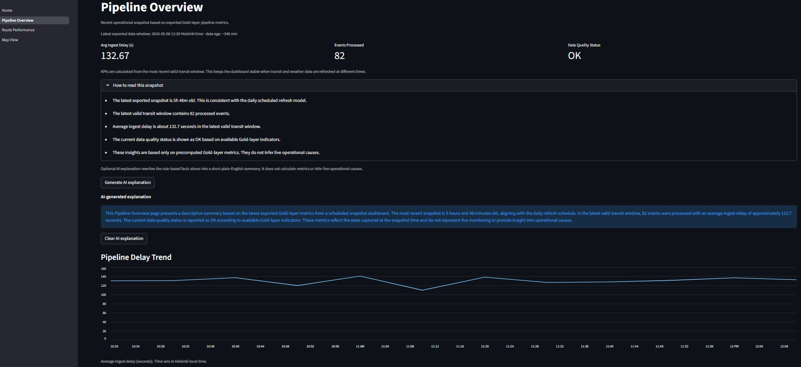

### Route Performance with AI explanation

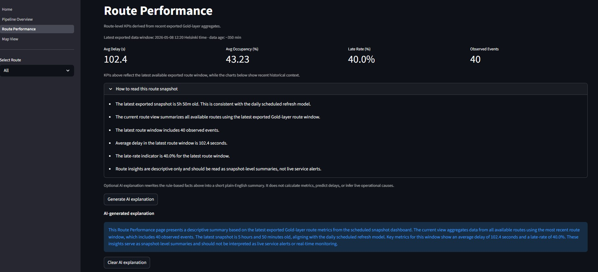

### All-route ranking view

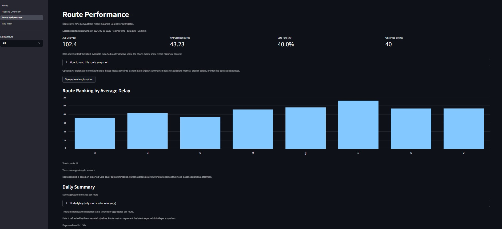

### Data Quality checks by dataset

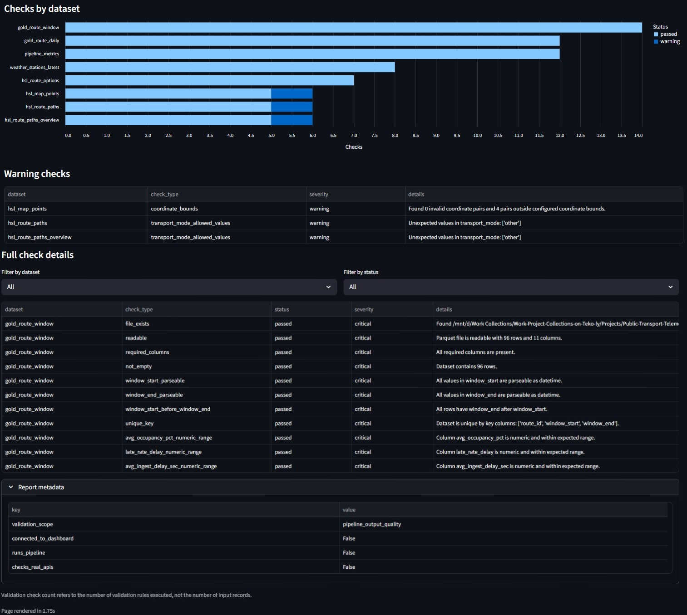

### Azure Container Apps scheduled job

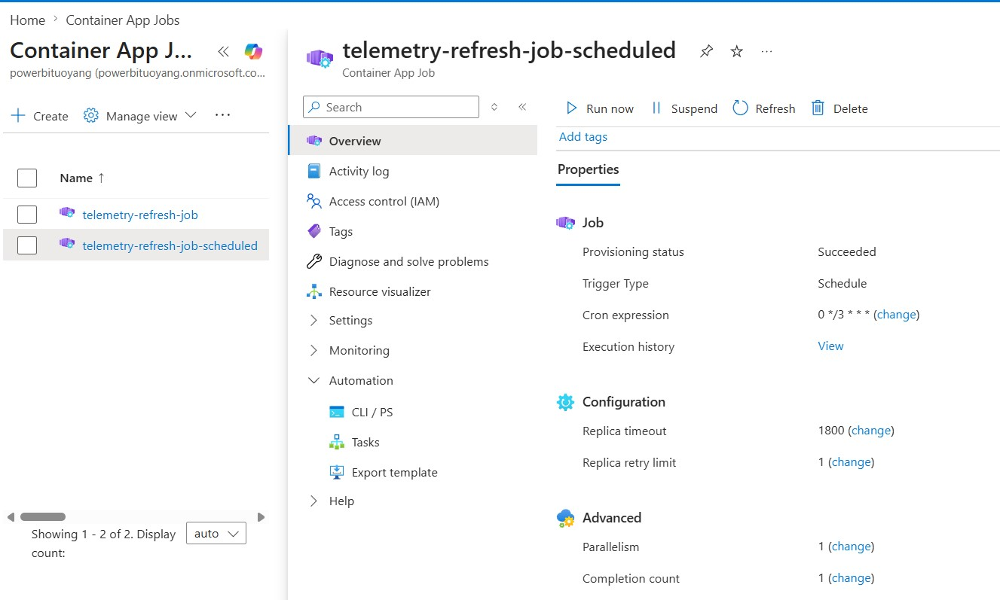

### Containerized refresh validation

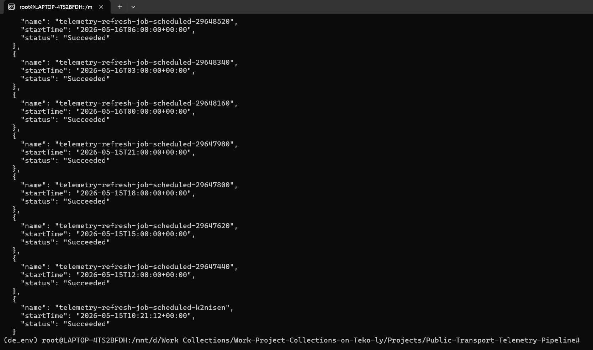

### Azure cost analysis / NAT Gateway monitoring

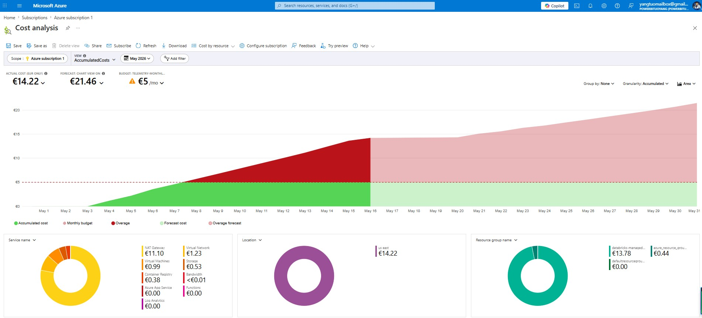

### Databricks schedule paused for cost control

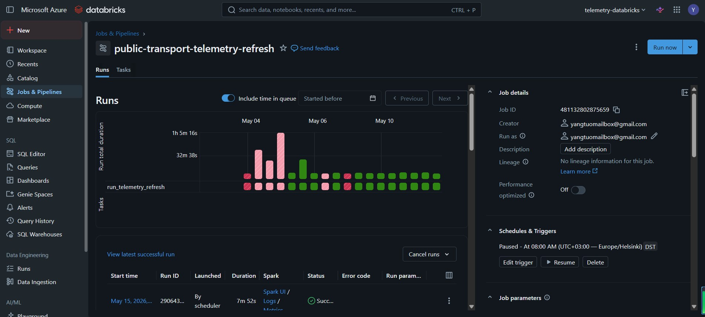

### Databricks compute inactive after migration

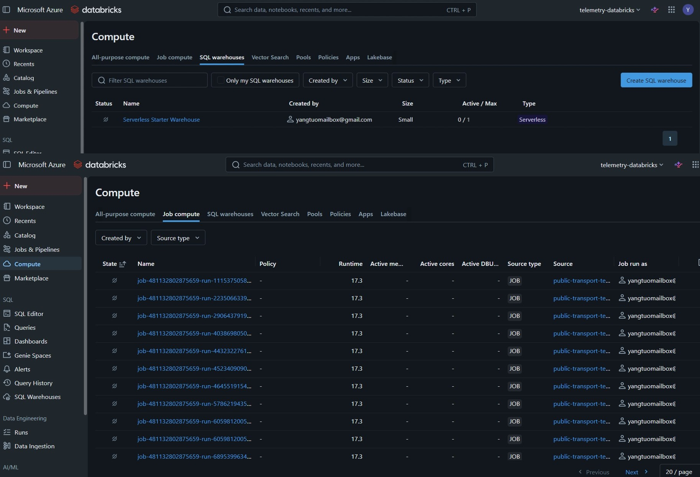

### Azure Databricks successful run

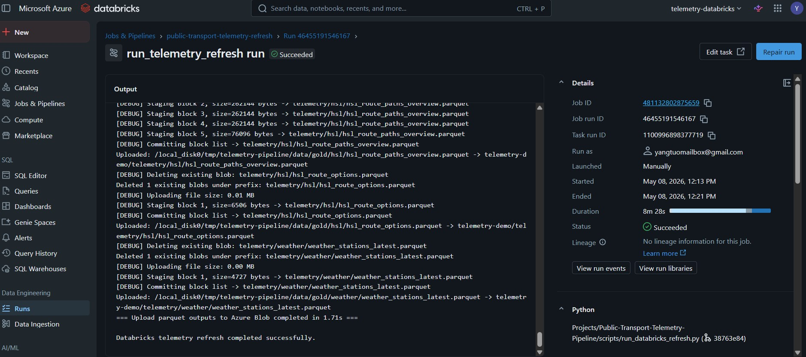

### Azure Function metadata heartbeat

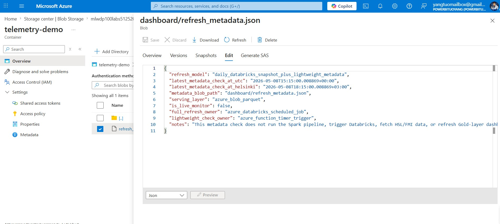

### UptimeRobot keepalive check

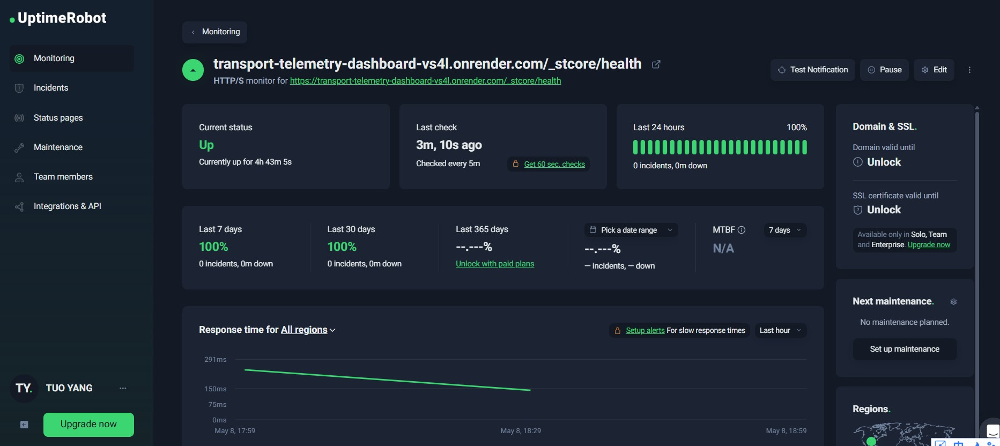

</details>

---

## Possible Extensions

Possible future extensions include:

- structured streaming with lower-latency ingestion
- stronger backfill and reprocessing support
- automated alerting on pipeline health metrics
- richer data quality checks
- additional external context sources
- production deployment using company-owned cloud infrastructure
- Key Vault or managed identity for secret management

---

## License

This project is covered by the MIT License at the repository root.


